# BrandyManager Database Design

Este documento describe la primera fase de BrandyManager: hilo musical para empresas, sedes, zonas y dispositivos. La radio online queda fuera de este esquema.

## Estructura de Apps

- `users`: usuario personalizado por email, UUID y autenticacion JWT.
- `organizations`: empresas, membresias, sedes, zonas, grupos, ambitos y grants de membresia.
- `authorization`: permisos globales, roles internos de plataforma y roles de empresa.
- `billing`: planes, suscripciones, licencias y asignaciones historicas de licencias a zonas.
- `catalog`: generos, etiquetas, contenidos de audio, canciones IA, mensajes, assets, analisis y procesado.
- `playlists`: playlists, snapshots, canales, politicas de canal y grants de acceso a contenido.
- `scheduling`: programaciones, bloques, excepciones y asignaciones por ambito.
- `campaigns`: campanas, mensajes, reglas, horarios y targets.
- `devices`: dispositivos, credenciales, comandos, eventos, estado, asignaciones y sincronizacion.
- `playback`: politicas de reproduccion, manifiestos, sesiones y eventos de reproduccion.
- `audit`: registros de auditoria append-only.
- `support`: incidencias, eventos de incidencia y notificaciones.
- `shared.db`: modelos base UUID/timestamps y validadores reutilizables.

## Decisiones de Adaptacion

1. La app existente `users` se mantiene en vez de crear `accounts`, para evitar duplicar autenticacion.
2. `User` pasa a `UUIDField` y `AbstractBaseUser`; el login depende de `email`, no de `username`.
3. El rol simple anterior `admin/client` se sustituye por membresias, roles, permisos y ambitos. Los administradores internos viven en `PlatformRole` y `is_superuser` queda como mecanismo Django de emergencia.
4. Las licencias se asignan a `Zone` mediante `LicenseAssignment`; cambiar un dispositivo no modifica la licencia.
5. Las relaciones principales usan claves foraneas explicitas. `AuditLog` usa `entity_type`/`entity_id` de forma logica para sobrevivir a archivados, sin `GenericForeignKey`.
6. El servicio Go no posee tablas de negocio. Los modelos Django usan UUID para contratos API estables.
7. Las canciones no tienen artista, album ni creditos; usan un genero principal y multiples etiquetas.
8. Las restricciones cross-company se validan con `clean()` y servicios, porque PostgreSQL no puede comprobar facilmente coherencia entre empresas a traves de varias claves foraneas.
9. Algunas apps tienen varias migraciones `000*_initial` porque Django separa dependencias circulares entre dominios. Se mantienen revisables por modulo.
10. Se recreo el volumen local de PostgreSQL para aplicar desde cero el nuevo usuario UUID/email y el esquema completo.

## Diagrama

```mermaid
erDiagram
  User ||--o{ CompanyMembership : belongs_to
  Company ||--o{ CompanyMembership : has
  Company ||--o{ OrganizationalUnit : contains
  Company ||--o{ Site : owns
  Site ||--o{ Zone : contains
  Company ||--o{ ResourceGroup : owns
  Company ||--o{ ResourceScope : defines
  ResourceScope ||--o{ MembershipGrant : scopes
  CompanyMembership ||--o{ MembershipGrant : receives
  CompanyRole ||--o{ MembershipGrant : grants
  Permission ||--o{ CompanyRolePermission : included_in
  CompanyRole ||--o{ CompanyRolePermission : has
  PlatformRole ||--o{ PlatformRolePermission : has
  User ||--o{ UserPlatformRole : assigned

  Company ||--o{ Subscription : subscribes
  Plan ||--o{ Subscription : selected
  Subscription ||--o{ License : includes
  License ||--o{ LicenseAssignment : assigned
  Zone ||--o{ LicenseAssignment : licensed

  Genre ||--o{ Song : classifies
  AudioContent ||--|| Song : song_details
  AudioContent ||--|| AudioMessage : message_details
  Song ||--o{ SongTag : tagged
  Tag ||--o{ SongTag : classifies
  AudioContent ||--o{ AudioAsset : has
  AudioAsset ||--|| AudioAnalysis : analyzed

  Playlist ||--o{ PlaylistItem : contains
  Playlist ||--o{ PlaylistSnapshot : publishes
  PlaylistSnapshot ||--o{ PlaylistSnapshotItem : freezes
  Channel ||--o{ ChannelPlaylist : combines
  Playlist ||--o{ ChannelPlaylist : used_by
  Channel ||--|| ChannelPolicy : configured_by

  Schedule ||--o{ ScheduleBlock : contains
  Schedule ||--o{ ScheduleException : overrides
  ResourceScope ||--o{ ScheduleAssignment : receives

  PlaybackPolicy ||--o{ PlaybackPolicyAssignment : assigned
  PlaybackPolicy ||--o{ PlaybackPolicyAllowedChannel : allows
  ResourceScope ||--o{ PlaybackPolicyAssignment : scopes

  Campaign ||--o{ CampaignMessage : contains
  Campaign ||--o{ CampaignRule : schedules
  CampaignRule ||--o{ CampaignRuleTime : times
  ResourceScope ||--o{ CampaignTarget : targets

  Company ||--o{ Device : owns
  Device ||--o{ DeviceZoneAssignment : assigned
  Zone ||--o{ DeviceZoneAssignment : uses
  Device ||--o{ DeviceCommand : receives
  Device ||--o{ DeviceEvent : emits
  Device ||--|| DeviceState : snapshot

  Zone ||--o{ ContentManifest : receives
  ContentManifest ||--o{ ContentManifestItem : includes
  Device ||--o{ DeviceSync : syncs
  ContentManifest ||--o{ DeviceSync : used_by
  Device ||--o{ DeviceCachedAsset : caches
  AudioAsset ||--o{ DeviceCachedAsset : stored

  Zone ||--o{ PlaybackSession : plays
  Device ||--o{ PlaybackSession : runs
  PlaybackSession ||--o{ PlaybackEvent : records
  AudioContent ||--o{ PlaybackEvent : played

  Company ||--o{ AuditLog : audits
  User ||--o{ AuditLog : acts
  Device ||--o{ AuditLog : acts
  Company ||--o{ Incident : has
  Incident ||--o{ IncidentEvent : history
  User ||--o{ Notification : receives
```

## Servicios de Dominio Iniciales

- `billing.services.assign_license_to_zone`
- `billing.services.unassign_license`
- `devices.services.assign_device_to_zone`
- `devices.services.replace_zone_device`
- `devices.services.create_device_command`
- `playlists.services.publish_playlist`
- `scheduling.services.resolve_effective_schedule`
- `playback.services.resolve_effective_policy`
- `playback.services.can_execute_playback_action`
- `playback.services.create_manifest`
- `campaigns.services.campaign_is_active_at`
- `authorization.services.resolve_effective_permissions`
- `audit.services.register_audit_log`

Las operaciones criticas se implementan con servicios explicitos para evitar esconder reglas de negocio en signals.

## Datos Iniciales

El comando `seed_initial_data` crea:

- Permisos iniciales.
- Roles internos de plataforma.
- Plantillas globales de roles de empresa.
- Categorias de etiquetas.
- Generos musicales iniciales.

No crea empresas, usuarios ni contenido de prueba.
